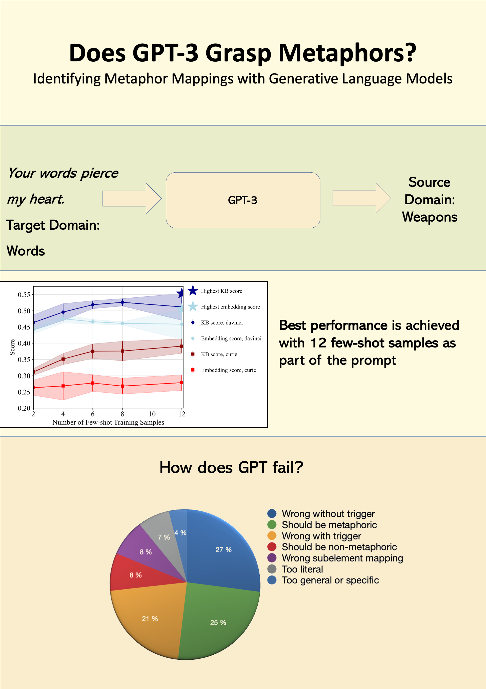

# Metaphor Extraction With GPT-3

## Reference

[PDF](https://aclanthology.org/2023.acl-long.58/)

[Video Presentation](https://youtu.be/TaReifZ5gy4)
  
>@inproceedings{wachowiak2023metaphor,  
>  title={{Does GPT-3 Grasp Metaphors? Identifying Metaphor Mappings with Generative Language Models}},   
>  author={Wachowiak, Lennart and Gromann, Dagmar},  
>  booktitle={Proceedings of the 61th Annual Meeting of the Association for Computational Linguistics (Long Papers)},  
>  year={2023}
>}

## Abstract
Conceptual metaphors present a powerful cognitive vehicle to transfer knowledge structures from a source to a target domain. Prior neural approaches focus on detecting whether natural language sequences are metaphoric or literal. We believe that to truly probe metaphoric knowledge in pre-trained language models, their capability to detect this transfer should be investigated. To this end, this paper proposes to probe the ability of GPT-3 to detect metaphoric language and predict the metaphor’s source do main without any pre-set domains. We experiment with different training sample configurations for fine-tuning and few-shot prompting on two distinct datasets. When provided 12 few-shot samples in the prompt, GPT-3 generates the correct source domain for a new sample with an accuracy of 65.15% in English and 34.65% in Spanish. GPT’s most common error is a hallucinated source domain for which no indicator is present in the sentence. Other common errors include identifying a sequence as literal even though a metaphor is present and predicting the wrong source domain based on specific words in the sequence that are not metaphorically related to the target domain.

## How to Use

- The code for repeating the experiments can be found in the notebook [analysis.ipynb](https://github.com/lwachowiak/Metaphor-Extraction-With-GPT-3/blob/main/analysis.ipynb). Used python packages are described in the [requirements file](https://github.com/lwachowiak/Metaphor-Extraction-With-GPT-3/blob/main/requirements.txt). An OpenAI API Key is required. 
- Data for prompting and fine-tuning can be found in the [Data](https://github.com/lwachowiak/Metaphor-Extraction-With-GPT-3/tree/main/Data) folder. The LCC corpus should be requested from the authors of the LCC corpus. 
- Annotations made through GPT-3 can be found in the respective folders for [validation](https://github.com/lwachowiak/Metaphor-Extraction-With-GPT-3/tree/main/Validation%20Results/Source%20Completion) and [test](https://github.com/lwachowiak/Metaphor-Extraction-With-GPT-3/tree/main/Test%20Results/Source%20Completion/Few%20Shot) results. The test data also contains the authors' annotations.

